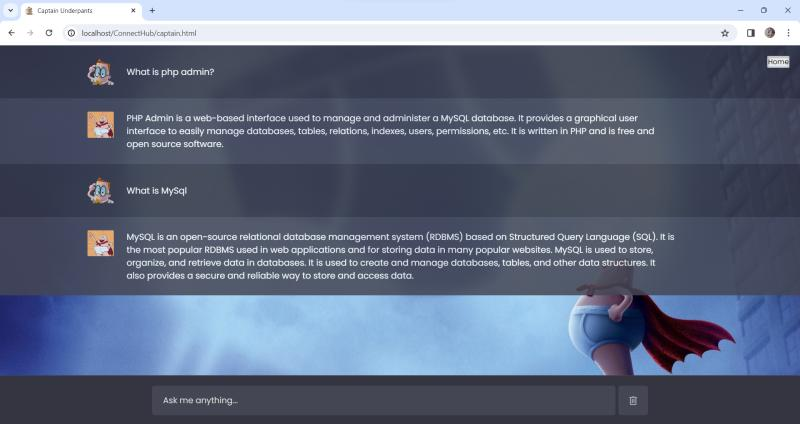
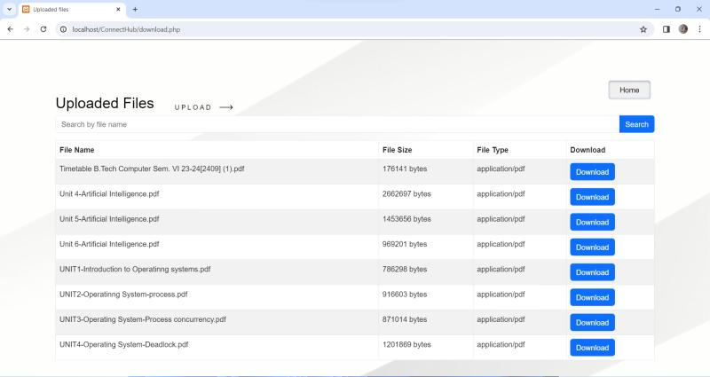
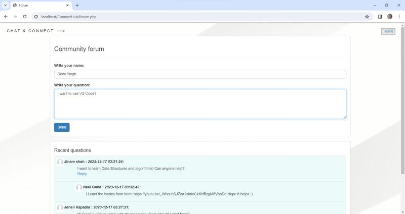
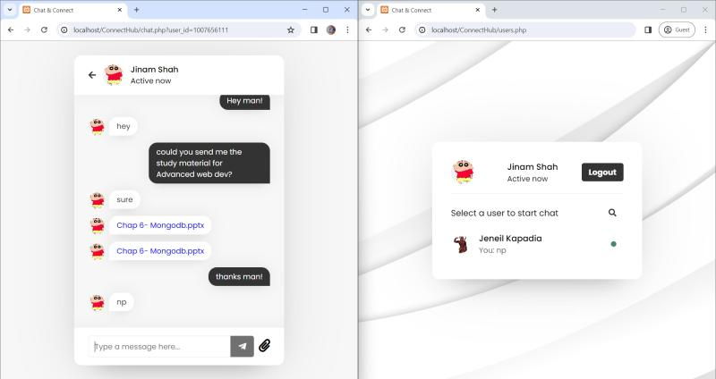

# ConnectHub

**ConnectHub** is a dynamic knowledge-sharing platform designed to foster collaboration and streamline communication. Through seamless one-on-one chat and file sharing capabilities, users can engage in direct and efficient communication. The integration of an **Instant Q&A feature powered by ChatGPT** ensures swift access to accurate information, enhancing user productivity. Additionally, ConnectHub features a centralized **KnowledgeVault**, offering users a comprehensive collection of documents and resources for easy access and reference.

---

## Features

| Feature | Description |
|---------|-------------|
| **Instant Q&A** | Real-time answers powered by OpenAI/ChatGPT API |
| **One-on-One Chat** | Live messaging between users |
| **File Sharing** | Upload/download files in conversations |
| **Knowledge Vault** | Centralized document repository |
| **Community Forum** | Public discussion boards |
| **User Authentication** | Secure login/register system |
| **Responsive Design** | Mobile and desktop compatible |

---

## Tech Stack

```
Frontend: HTML5, CSS3, JavaScript, jQuery, Bootstrap
Backend: PHP
Database: MySQL
AI: OpenAI API (ChatGPT)
Assets: Web fonts, custom icons
Dependencies: Vendor libraries (Bower)
```

---

## Quick Start

### Prerequisites

- PHP 7.4+ with MySQL extension
- MySQL 5.7+ database server
- Web server (Apache/XAMPP/WAMP)
- OpenAI API key

### Setup

**1. Clone the repository**

```bash
git clone https://github.com/Jinam-Shah/ConnetHub-Web-Application.git
cd connecthub
```

**2. Database Setup**

- Create a MySQL database named `connecthub`
- Import the schema (look for `db.sql` or run the setup script)
- Update database credentials in config files

**3. Environment**

Copy `.env.example` to `.env` and add your OpenAI API key:

```env
OPENAI_API_KEY=sk-...
DB_HOST=localhost
DB_NAME=connecthub
DB_USER=root
DB_PASS=
```

**4. Run locally**

```bash
# Using PHP built-in server
php -S localhost:8000

# Or place in XAMPP htdocs and visit localhost/connecthub
```

**5. Access the application**

Open `http://localhost:8000` (or your server URL).

---

## 🗄 Database

The application uses a MySQL database with tables for:

- `users` (authentication)
- `chats` (messages)
- `files` (uploads)
- `knowledge_vault` (documents)
- `forum_posts` (community)

Schema included in project files or setup scripts.

---

## Project Structure

```
ConnectHub-master/
├── index.html          # Landing page
├── chat.php            # Chat interface
├── login.php           # Authentication
├── config/             # Database & API config
├── js/                 # JavaScript files
│   ├── login.js
│   └── users.js
├── assets/             # Images, fonts
├── vendor/             # Bower dependencies (ignored)
└── uploads/            # User file uploads
```

---

## 🔧 Development

### Environment Variables

Create `.env` from `.env.example`:

```env
OPENAI_API_KEY=your-key-here
DB_HOST=localhost
DB_NAME=connecthub
DB_USER=root
DB_PASS=your-mysql-password
```

### API Keys

- **OpenAI**: Get from [platform.openai.com](https://platform.openai.com)

---

## Screenshots

**Home Page**  


**Instant Q&A (ChatGPT)**  


**Knowledge Vault**  


**Community Forum**  


**Chat & File Sharing**  


---

## Deployment

### XAMPP (Windows)

1. Copy project to `htdocs/connecthub`
2. Start Apache + MySQL
3. Visit `localhost/connecthub`

### Production (Apache/Nginx)

- Configure PHP-FPM
- Set up MySQL with proper user permissions
- Secure upload directories
- Use HTTPS

---

## Contributing

1. Fork the repository
2. Create feature branch: `git checkout -b feature/amazing-feature`
3. Commit changes: `git commit -m 'Add amazing feature'`
4. Push to branch: `git push origin feature/amazing-feature`
5. Open Pull Request

---

## Author

**Jinam Shah**

- GitHub: [@Jinam-Shah](https://github.com/Jinam-Shah)

---
